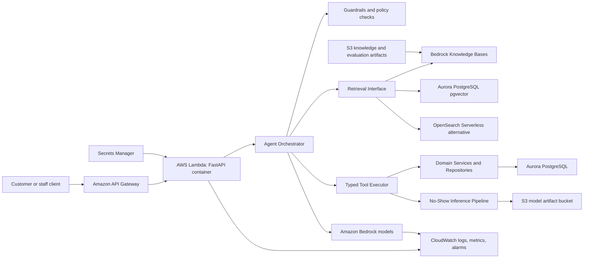

# AWS Production Architecture

This document describes how the implemented local DealerAI Ops architecture maps to a proposed AWS
production deployment. It is design documentation only. No AWS infrastructure has been provisioned,
and the repository remains runnable without AWS credentials.

## Implementation Status

| Capability | Repository status | Proposed AWS production mapping |
| --- | --- | --- |
| FastAPI application | IMPLEMENTED | API Gateway plus AWS Lambda container image |
| Health and readiness endpoints | IMPLEMENTED | API Gateway routes backed by Lambda |
| SQLAlchemy domain persistence | IMPLEMENTED | Aurora PostgreSQL in private subnets |
| SQLite local fallback | IMPLEMENTED | Local and CI only |
| Typed tool executor | IMPLEMENTED | Lambda application code, never direct LLM database writes |
| Confirmation and idempotency | IMPLEMENTED | Persisted in Aurora with unique idempotency records |
| Local deterministic LLM provider | IMPLEMENTED | Local test mode only |
| Amazon Bedrock provider adapter | IMPLEMENTED adapter surface | Bedrock Converse or InvokeModel in production |
| Local RAG retriever | IMPLEMENTED | Bedrock Knowledge Bases or pgvector/OpenSearch adapter |
| Synthetic knowledge corpus | IMPLEMENTED | S3 versioned document source |
| No-show sklearn model | IMPLEMENTED | Lambda-loaded artifact from S3 or container image |
| Observability spans | IMPLEMENTED | CloudWatch Logs, metrics, alarms, and traces |
| Secrets configuration | IMPLEMENTED via environment settings | AWS Secrets Manager and encrypted Lambda env refs |
| Streamlit demo UI | IMPLEMENTED | Demo-only; optional separate internal app hosting |

## High-Level Architecture

The agent remains an application-controlled orchestration loop. Bedrock may produce structured tool
requests, but only the Lambda application validates those requests and executes tools through the
service/repository layer.

## Network And Security Boundaries

- API Gateway is the public ingress boundary for the production API.
- Lambda runs with a narrow execution role and reaches Aurora through VPC networking.
- Aurora PostgreSQL is private, with no public endpoint.
- Secrets Manager stores database credentials, Bedrock configuration overrides, and optional provider
  settings.
- S3 buckets use block public access, encryption at rest, versioning, and explicit bucket policies.
- Bedrock calls leave the VPC boundary as AWS managed service calls, authorized by IAM.
- CloudWatch receives redacted logs and metrics; raw prompts, customer contact fields, and secrets
  should not be logged.

Recommended production layout:

- Public: API Gateway, optional WAF.
- Private application: Lambda configured for VPC access where database access is needed.
- Private data: Aurora PostgreSQL subnets and security groups.
- Managed AI/retrieval: Bedrock, Bedrock Knowledge Bases, S3, optional OpenSearch Serverless.
- Operations: CloudWatch dashboards, alarms, logs, and retention policies.

## Bedrock Model And Tool Use

IMPLEMENTED locally:

- Provider-independent LLM interface.
- Deterministic local provider for tests.
- Bedrock provider adapter surface.
- Structured model responses: final answer or typed tool request.
- Agent loop that validates tool names and arguments before execution.
- Confirmation workflow for transactional tools.

PROPOSED AWS mapping:

- Use Amazon Bedrock Converse API for chat-style orchestration where supported.
- Represent each tool's Pydantic schema as the Bedrock tool specification.
- Treat Bedrock tool use as a request, not as execution.
- Enforce the application's tool allowlist before running any requested tool.
- Validate arguments with Pydantic in Lambda.
- Require explicit customer confirmation for high-risk writes, regardless of Bedrock output.
- Return tool results to Bedrock only after successful deterministic execution.
- Block final answers that claim transaction success without a successful tool result.

Bedrock should not receive raw database credentials, direct SQL tools, arbitrary code execution tools,
or unrestricted customer exports.

## Retrieval Options

### Bedrock Knowledge Bases

PROPOSED as the managed default for production RAG:

- Store source documents in S3.
- Use Bedrock Knowledge Bases to ingest, chunk, embed, and retrieve approved policy documents.
- Keep document metadata fields such as `document_id`, `title`, `section`, `source_path`, `version`,
  and `synthetic` or data-classification labels.
- Return citations to the application and preserve source references in final answers.

Best fit:

- Teams want managed ingestion and retrieval.
- Knowledge documents are mostly policy, FAQ, and operational guidance.
- Operational simplicity matters more than custom retrieval control.

### Aurora PostgreSQL pgvector

PROPOSED for tighter database-centric retrieval:

- Add pgvector extension to Aurora PostgreSQL.
- Store chunk metadata and embeddings in versioned tables.
- Use repository-backed vector queries through the existing vector-store interface.
- Join retrieval metadata with application-owned policy records if needed.

Best fit:

- Teams want transactional control of vectors and metadata.
- Retrieval corpus is moderate in size.
- Database backup, audit, and access patterns should stay centralized.

### OpenSearch Serverless

PROPOSED alternative for larger or search-heavy corpora:

- Store text/vector indexes in OpenSearch Serverless.
- Use hybrid lexical plus vector retrieval.
- Apply index policies, encryption, network policies, and IAM access controls.

Best fit:

- Large corpus, high query volume, hybrid search, filtering, or analytics-style search needs.
- Retrieval traffic should scale independently from Aurora.

## S3 Usage

PROPOSED buckets:

- Knowledge source bucket: versioned synthetic or approved policy documents.
- Model artifact bucket: serialized no-show model, preprocessing pipeline, metadata, metrics, and
  feature schema.
- Evaluation artifact bucket: evaluation reports, release-gate outputs, and model/prompt comparison
  packages.
- Optional trace archive bucket: long-retention redacted observability exports.

Security requirements:

- Block public access.
- Use SSE-S3 or SSE-KMS.
- Enable versioning for rollback.
- Restrict reads/writes by IAM role and object prefix.
- Never store plaintext secrets in S3.

## Database Access

IMPLEMENTED locally:

- SQLAlchemy models and repository/service boundaries.
- PostgreSQL-compatible database URL support.
- SQLite fallback for deterministic tests.
- Typed tools use domain services; LLMs do not access the database.

PROPOSED AWS mapping:

- Aurora PostgreSQL stores customers, vehicles, appointments, service history, slots, leads,
  conversations, tool executions, idempotency records, and escalations.
- Lambda uses a database secret from Secrets Manager.
- Use RDS Proxy if connection churn becomes material.
- Use migrations before production deployments.
- Use row-level or service-level access controls for multi-dealer tenancy if this becomes a
  multi-tenant SaaS product.
- Keep idempotency keys unique and transactionally checked for booking, rescheduling, cancellation,
  lead creation, and handoff actions.

## IAM Least Privilege

Suggested Lambda execution role permissions:

- `bedrock:InvokeModel` and/or Bedrock Converse permissions only for approved model IDs.
- `secretsmanager:GetSecretValue` only for required application secrets.
- `s3:GetObject` for model artifacts and knowledge configuration prefixes.
- `s3:PutObject` only for evaluation or trace artifact prefixes when needed.
- CloudWatch Logs write permissions for the function log group.
- Aurora access through network security groups and database credentials, not broad AWS account
  permissions.

Explicitly avoid:

- Wildcard `bedrock:*`, `s3:*`, or `secretsmanager:*` in production roles.
- IAM permissions that allow the application to mutate infrastructure.
- Any role that lets a model output directly call AWS APIs.

## Secret Management

IMPLEMENTED locally:

- Environment-based configuration with no required secrets.
- `.env.example` contains safe local defaults.

PROPOSED AWS mapping:

- Store database credentials in Secrets Manager.
- Store third-party provider keys, if any, in Secrets Manager.
- Reference secret ARNs in deployment configuration rather than copying values into environment
  variables.
- Rotate database credentials on a schedule.
- Deny secret reads from CI roles except deployment jobs that truly need them.
- Redact secret-like values in logs and traces.

## PII Handling

The repository uses synthetic data only, but the production design should assume real customer data
could eventually exist.

Controls:

- Redact customer phone numbers, email addresses, addresses, tokens, and secrets before logs/traces.
- Do not send bulk customer records to Bedrock.
- Retrieve only the minimum customer context needed for a single request.
- Keep escalation packages minimal and staff-facing.
- Apply data-classification metadata to S3 knowledge and artifact objects.
- Define retention windows for conversations, traces, escalations, and evaluation payloads.
- Use synthetic data for demos, CI, and evaluation scenarios.

## Tool Execution Boundaries

The production boundary is the same as local:

- Bedrock can request a tool call.
- The agent validates tool name and schema.
- Authorization runs before execution.
- Confirmation is required for high-risk writes.
- The typed tool executor calls domain services.
- Domain services call repositories.
- Repositories use SQLAlchemy sessions.
- The database receives only validated deterministic writes.

No production design should add a direct SQL tool, arbitrary Python execution, or a broad AWS action
tool to the model context.

## Observability

IMPLEMENTED locally:

- Redacted spans for conversation, LLM call, retrieval, tool call, ML inference, guardrail decision,
  and human escalation.
- Correlation IDs, request IDs, conversation IDs, latency, model version, prompt version, and error
  metadata.

PROPOSED AWS mapping:

- Emit structured JSON logs to CloudWatch Logs.
- Create CloudWatch metrics from log filters or embedded metric format.
- Track latency and error rates by route, tool, model version, prompt version, risk tier, and
  escalation reason.
- Alarm on provider failures, tool error spikes, elevated latency, safety policy blocks, and
  regression-gate failures.
- Send evaluation and release-gate summaries to S3 and optionally surface them in dashboards.
- Keep trace retention short enough to satisfy privacy policy and long enough for debugging.

## Failure Handling

Expected failures and responses:

- Bedrock unavailable: degrade to a customer-safe failure or deterministic local mode only in
  non-production environments; escalate sensitive customer requests.
- Retrieval unavailable: answer only if the agent can do so safely without RAG, otherwise say sources
  are unavailable and escalate when needed.
- Aurora unavailable: fail closed for writes and avoid claiming success.
- Model artifact unavailable: return structured ML service error and avoid risk-tier claims.
- Tool validation failure: return structured tool error and do not execute.
- Duplicate booking request: replay the idempotent response or reject conflicts deterministically.
- Prompt injection or secret/PII exfiltration attempt: block and route according to guardrail policy.

## Scaling

- API Gateway and Lambda scale request handling horizontally.
- Use provisioned concurrency for latency-sensitive assistant routes.
- Use RDS Proxy or a connection pool strategy to protect Aurora from Lambda fan-out.
- Split long-running ingestion, evaluation, and model-training jobs from request-time Lambda handlers.
- Store static model artifacts in S3 and cache them in warm Lambda execution environments.
- Use Bedrock Knowledge Bases or OpenSearch Serverless when retrieval indexing/search should scale
  independently from the transactional database.

## Cost Considerations

- Bedrock model choice drives per-request AI cost. Use smaller models for routing or low-risk
  classification where quality gates allow it.
- Bound maximum tool iterations and retrieval context to cap latency and token usage.
- Use deterministic evaluations before model/prompt changes to avoid expensive production regressions.
- Prefer S3 for low-cost artifact storage.
- Use Aurora capacity settings appropriate to expected traffic; consider Serverless v2 for variable
  workloads.
- Use CloudWatch retention policies to avoid unbounded log costs.
- Cache knowledge retrieval indexes and model artifacts where safe.

## Deployment Strategy

PROPOSED deployment flow:

1. Run unit tests, type checks, linting, deterministic agent evaluations, and release gate in CI.
2. Build a Lambda container image for the FastAPI app.
3. Publish immutable model, knowledge, and evaluation artifacts to versioned S3 prefixes.
4. Deploy infrastructure through IaC such as AWS CDK, Terraform, or CloudFormation.
5. Configure Lambda environment variables with non-secret settings and Secrets Manager ARNs.
6. Run database migrations.
7. Run smoke tests against `GET /health`, `GET /ready`, `POST /agent/run`, and
   `POST /ml/no-show/predict`.
8. Shift traffic gradually through API Gateway stage deployment or alias-based Lambda routing.

## Rollback Strategy

- Keep previous Lambda image versions and aliases.
- Keep S3 object versions for model and knowledge artifacts.
- Keep database migrations reversible when possible; use expand-contract migrations for risky schema
  changes.
- Roll back prompt/model versions independently from application code when compatible.
- Restore the previous Bedrock model ID or prompt version when evaluation gates fail after release.
- Use idempotency records to avoid duplicate customer-impacting writes during retries or rollbacks.

## Production Readiness Gaps

These items are intentionally not implemented in the repository yet:

- Infrastructure-as-code definitions.
- Database migration tooling.
- Real AWS resource provisioning.
- Production authentication and authorization integration.
- Bedrock Knowledge Base ingestion jobs.
- pgvector schema migrations and vector indexes.
- OpenSearch Serverless collection/index configuration.
- CloudWatch dashboards and alarms.
- Secrets Manager secret creation and rotation policies.
- Multi-dealer tenant isolation.

The current repository demonstrates the application boundaries needed for these mappings, while this
document defines the proposed AWS target architecture.
